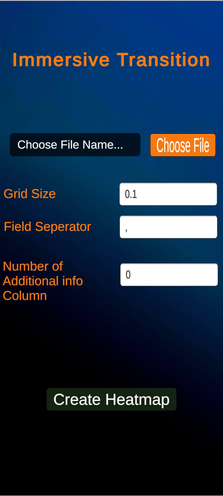
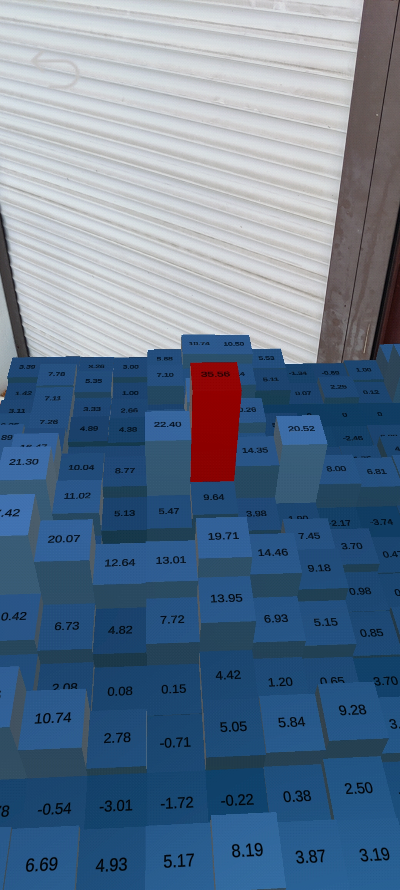

# Immersive-Visualization-Transition
Introducing an innovative AR app that visualizes data in a unique way. The app allows users to input data, which is then displayed as a heatmap in 2D. After placing heatmap in the real world, the heatmap transforms into a 3D representation, offering a more immersive experience. This app provides additional data as the user interacts with the cells, it displays additional information about that particular data. Experience the future of data visualization with this exciting AR app!

# How to use the application:
To use the AR app, follow these steps:

* Open the app on your AR-enabled device.
* Select the data file you wish to visualize. This can be done by clicking on the "Chooser File" button.
* You can customize the grid size by entring your desired value on the field "Grid Size".
* The "Field Seprator" is responsible for spliting the data into individual column (ex. "," for csv files).
* The field "Number of Additional info Column" is reposnsible to provide the information on how many colomns should be used as 
  additional information. (Note: The number of columns you provide will be the last n numbers of columns in the dataset)
* After providing all information click on the "Create Heatmap" button.
* Now move aroud your AR device to detect the plan.
* Once the plan is detected click on the position you want to place Heatmap.

> Note: App will display addtional information as you you interact with the cell.

# Demo Images:
|  |  | 
|:--:| :--:| 
| *Intro Scene* |*Heatmap View* |
